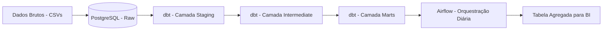

# Projeto: Plataforma de Dados para Análise de Vendas (dbt + Airflow + Docker)


## 🎯 Contexto e Objetivo de Negócio

Este projeto simula a construção de uma **plataforma de dados moderna** para uma empresa de e-commerce. O objetivo é consolidar dados brutos de clientes, produtos e vendas (100 mil registros) para gerar um **painel de receita mensal por categoria de produto**.

**Valor de negócio:** A área comercial pode, com este pipeline, tomar decisões baseadas em dados sobre quais categorias investir e precificar, com atualizações automáticas diárias.

## 🏗️ Arquitetura da Solução (Modern Data Stack)

O projeto implementa os conceitos de **Engenharia de Dados** em um ambiente containerizado e orquestrado.




# dbt-data-plataform

Este repositório é um exemplo de pipeline analítico construído com dbt, usando um
Postgres rodando em Docker como ambiente de desenvolvimento. Ele inclui seeds
(dados de exemplo), modelos de staging e uma estrutura mínima de projeto dbt.

Por que este projeto é importante
- Reprodutibilidade: demonstra como provisionar um banco local (Docker) e
	executar transformações de forma determinística com `dbt`.
- Boas práticas de engenharia de dados: separação entre `seeds`, `staging`
	e modelos finais (marts), permitindo testes, documentação e lineage.
- Documentação e observabilidade: uso de `dbt docs` para gerar catálogo e
	documentação navegável, útil para times e auditoria de dados.

## Requisitos
- Docker
- `uv` (ambiente Python usado neste projeto)

## Uso rápido

1. Verifique que o Docker está rodando:

```bash
sudo systemctl status docker
```

2. Inicie (ou confirme) o container Postgres usado pelo projeto:

```bash
docker run --rm --name postgres-dbt -e POSTGRES_PASSWORD=secret -e POSTGRES_DB=analytics -p 5432:5432 -d postgres:15
```

3. Execute comandos dbt via `uv` (garante o ambiente correto):

```bash
# validar conexão
uv run dbt debug --profiles-dir .

# carregar seeds (CSV em `seeds/`)
uv run dbt seed --profiles-dir .

# compilar/executar modelos
uv run dbt run --profiles-dir .

# gerar docs
uv run dbt docs generate --profiles-dir .

# servir docs (http://localhost:8080)
uv run dbt docs serve --profiles-dir . --port 8080
```

4. Consultas rápidas no banco (exemplo):

```bash
PGPASSWORD=secret psql -h 127.0.0.1 -p 5432 -U postgres -d analytics -c "select count(*) from public.raw_vendas;"
```

## Arquivos importantes
- `profiles.yml` — credenciais/host/porta do banco usadas pelo dbt (não comitar credenciais sensíveis).
- `dbt_project.yml` — configuração do projeto dbt (model-paths, seed-paths, profile).
- `seeds/` — CSVs carregados com `dbt seed`.
- `models/` — modelos dbt (staging e marts).
- `COMMANDS.md` — referência dos comandos usados durante a configuração.

## Notas
- Se receber `permission denied` ao usar `docker`, adicione seu usuário ao grupo `docker`:

```bash
sudo usermod -aG docker $USER
newgrp docker
```

Arquivo atualizado em: 2026-08-13
